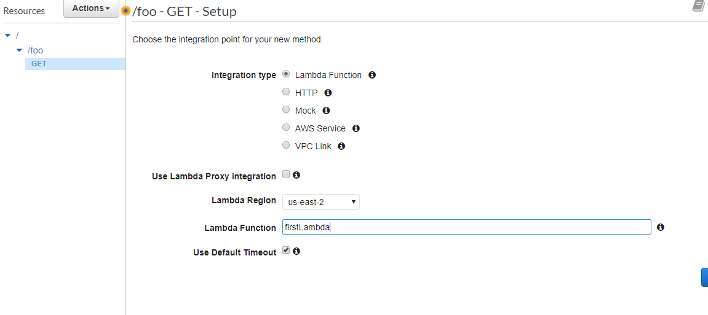
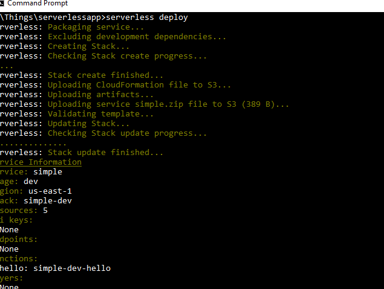

# learningaws
AWS Learning

Set up user in IAM and for keys

1 create dir ~/.aw  or %UserPRofile%\.aws

2 Add credentials to file credentials in form

[default]

aws_access_key_id=

aws_secret_access_key=

For serverless 

1 Install node.s > v6

2 Install serverless : npm install -g serverless

3 Check installed : serverless --version 

lambda cost 20c per million reqs + rounded 100 ms compute time + memory GB/sec * const

Create Lambda through AWS console create Role -basic Lambda execution -edit time out memory etc

API Gateway through mangement console use provided tempalte(Swagger 2.0)
Then click on new API /Create Resource called foo create GET method & lambda integration

save and test -will see call invocation on Lambda dashboard monitoring
Management console tedious hence serverless framework serverless.com

type servelss help or ssl --help to see commands

Create a serverless project

mkdir for serless files e.g app

create a service t(emplete) n(ame)
sls create --t aws-nodejs --n simple
create handler and serverless.yml file Can chage e.g regionssl deploy -f hello

deploy serverless
serverless deploy

deploy function:-
sls deploy -f hello

uploads to S3 and creates resources

Invoke remotely from command line :-
sls invoke -f hello

or locally invoke :-
sls invoke local -f hello

Edit yml file to create an API :-

sls deploy
provides endpoint for api to try in browser :-
 https://.......uof.execute-api.us-east-1.amazonaws.com/dev/hello
 
 Update handler.js e.g 
 
module.exports.hello = (event, context, callback) => {

   // console.log('event is', event);
   
	// console.log('contxt is', context);
	
	 let remainingTime=context.getRemainingTimeInMillis();
	 
	 let functionName=context.functionName;
	 
	 let AWSrequestID=context.awsRequestId;
	 
	 const response = {
	 
		 statusCode: 200,
		 
		 ev: event,
		 
		 rt:remainingTime,
		 
		 fn:functionName,
		 
	     aid: AWSrequestID
	     
	 };
	 
	 callback(null, response);
 
  // Use this code if you don't use the http event with the LAMBDA-PROXY integration
  
  // return { message: 'Go Serverless v1.0! Your function executed successfully!', event };
  
};

Create a local event,json file e.g :-

{
"foo" : "bar"
}

invoke with event from json file

sls invoke local -f hello -p event.json
can send to remote too :-

sls invoke  -f hello -p event.json

Callback is same as return in function could return error:-
e.g callback(new Error('broke'));

<h3> Testing and Debugging </h3>

View remote logs sls logs -f hello

